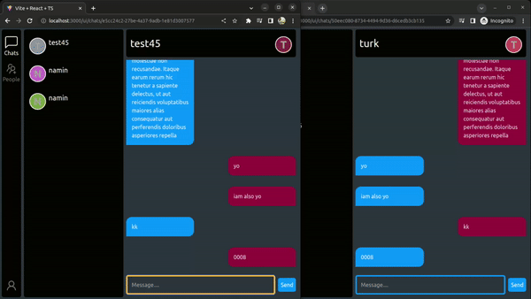

# Chat

## Simple Chat app using Golang and Svellte

## RoadMap

- [x] Basic SSE chat protocol
- [ ] User Auth and TLS
- [ ] Groups and Direct Message
- [ ] Encrypted P2P

# ScreenShots

## Running And Compiling

### Requirements

- [Go](https://go.dev/) SDK need to be installed
- [NodeJs](https://nodejs.org/en)

### Run

    make run

### Build Binary

    make compile

### Without make

    cd ui3/
    yarn build
    cd ..
    go build .
